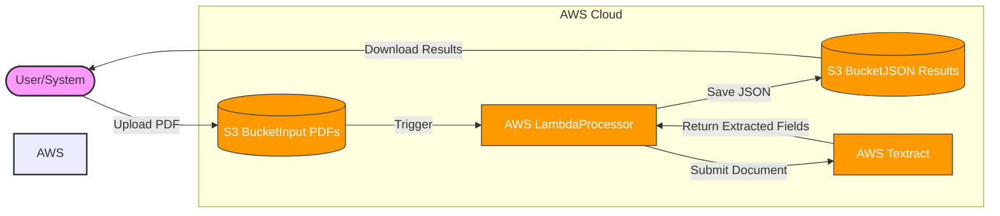

# PDF Form Extractor

A serverless solution for automated PDF form data extraction using AWS services.

## Overview

This proof of concept demonstrates automated extraction of form data from PDF documents using AWS Textract. The solution includes:

- Automatic triggering of extraction when PDFs are uploaded to S3
- Form field detection and data extraction using AWS Textract
- JSON output of extracted data
- Basic error handling and monitoring

## Architecture



## Business Benefits

1. **Cost Reduction**
   - Eliminate manual data entry costs
   - Reduce processing time from hours to minutes
   - Minimize human error in data entry

2. **Scalability**
   - Handle varying volumes of documents automatically
   - Process multiple documents concurrently
   - No infrastructure management required

3. **Accuracy**
   - AWS Textract's ML models ensure high accuracy
   - Consistent extraction results
   - Built-in confidence scores for validation

4. **Integration Ready**
   - JSON output can be easily integrated with existing systems
   - Event-driven architecture enables real-time processing
   - Extensible design for additional processing steps

## Prerequisites

- AWS Account
- AWS CLI installed and configured
- Node.js 18.x or later
- AWS CDK CLI installed (`npm install -g aws-cdk`)

## Setup Instructions

1. Clone the repository:
```bash
git clone https://github.com/your-repo/aws-pdf-form-extractor
cd aws-pdf-form-extractor
```

2. Install dependencies:
```bash
npm install
```

3. Deploy the infrastructure:
```bash
cdk deploy
```

4. The deployment will output the S3 bucket name for uploading PDFs.

## Usage

1. Upload a PDF form to the created S3 bucket:
```bash
aws s3 cp sample-form.pdf s3://your-bucket-name/
```

2. The extraction will start automatically, and results will be saved in the same bucket with a `.json` extension.


## Implementation Details

1. **PDF Upload Trigger**
   - S3 Event Notifications trigger Lambda function
   - Supports single file and batch processing
   - Automatic file type validation

2. **Extraction Process**
   - AWS Textract analyzes document layout
   - Form fields are identified and extracted
   - Confidence scores provided for validation

3. **Data Processing**
   - Structured JSON output generation
   - Field normalization and validation
   - Error handling and retries

4. **Storage**
   - Input PDFs versioned in S3
   - Results stored alongside source files
   - Optional retention policies

## Future Enhancements

- Add form template matching
- Implement validation rules
- Add API endpoints for direct integration
- Include OCR confidence threshold filtering
- Add support for multiple output formats
- Implement batch processing capabilities
- Add DynamoDB for metadata storage
- Create CloudWatch dashboards for monitoring

## Contributing

Feel free to submit issues and enhancement requests.